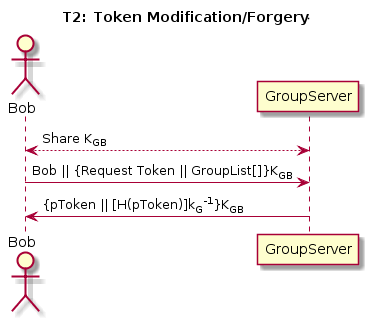
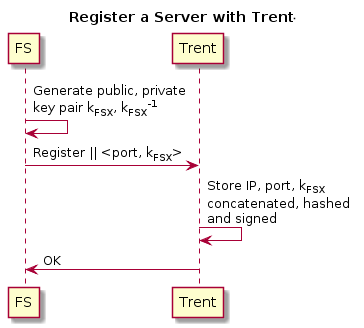

# CS 1653: Applied Cryptography and Network Security -- Phase 3 #
## Overview ##

This phase of the project is the first stage of hardening our Galactic File-Hosting Service (GFHS). We are still operating under the general assumption that the group server is entirely trustworthy, and that once a user has identified a file server appropriately, that server is also trustworthy and obeys all its rules. However, we will add some measures to enhance security on tokens, the user and file server ends, and to protect against third party monitoring on all communications.

We will use a variety of techniques and protocols to address the given threat models and keep our system secure. These are specified herewith, along with reasoning and justification for each. We also implemented a trusted mediated authentication service, called Trent. This server provides public keys for registered file servers.
*   Protocols:
    -   Secure Remote Password (SRP) -- SRP provides mutual authentication of the user and GroupServer and simultaneously allows them to agree on a session key, all securely and over an open channel. It leverages the fact that the user and GroupServer have a shared secret (set up when the user is created) to easily and securely establish a channel so the GroupServer can give the user their Token.
    -   Diffie-Hellman (D-H) key exchange -- Diffie-Hellman is a trusted and secure method for establishing a session key over an open channel. We chose to perform elliptic curve D-H exchanges and used elliptic curve group 21 (also used for SRP values[1](#f1)), since it is compatible with the 128-bit key lengths we are using, and it also provides next-gen security (i.e. it should be secure for at least the next two decades).[2](#f2)

*   Tools and Algorithms:
    -   AES (128-bit) -- We chose AES because it is the *de facto* standard for quick and secure symmetric key encryption according to NIST. The 128-bit version is projected to be secure for a number of years, and provides for the time being essentially the same security as larger key sizes. [3](#f3) We will be using AES with Galois/Counter Mode (GCM), which conveniently allows to both encrypt *and* authenticate in the same go. This allows us to detect errors or tampering with the ciphertext in some more secure way than just getting garbage when we decrypt. We will forgo any message padding for the time being to eliminate confusion and keep things simple.
    -   SHA-256 -- We chose SHA-256 because it is recommended for a variety of applications by NIST [5](#f5), along with salt to inhibit brute-force attacks. This will be used for two purposes: validating user passwords on the GroupServer, and hashing user Tokens in order to verify their origin. Details are in sections T1 and T2, respectively.
    -   RSA-2048 -- We use RSA signatures to guarantee the validity of a token and to sign public keys issued by Trent. RSA-2048 is approved by NIST for generation/verification of digital signatures and keys,[4](#f4) which is exactly what we are using it for.  

*   Bonus:  
    -   Trusted Mediator/Public Key Oracle ("Trent") -- Trent is our trusted source for public keys. He is a server that stores his own keypair, the GroupServer's public key, and the public key of any FileServer that is created on the network (each new FileServer is required to register with Trent on startup). Trent

## Threat Models ##
### T1: Unauthorized Token Issuance ###
This threat has to do with illegitimate or malicious parties requesting (and receiving) another user's token, thereby gaining access to that user's files and groups. This is problematic if that information is intended to be secure in any fashion (i.e. confidential or protected from unauthorized modification). Currently our system only requires a username in order to access that user's account--with all associated privileges--requiring no further form of authentication. An adversary can thus access any account she knows the name of, which is obviously undesirable.  

To address this threat, we chose to implement a Secure Remote Password (SRP) protocol, relying on a shared secret (i.e. hashed password) between the user and the GroupServer. This secret is set at user creation by the admin, and the GroupServer stores `<User, Value>` pairs. The SHA-256 hash of a password and salt will be used to calculate the `Value` for SRP and then stored, along with the salt alone, on the GroupServer. The salt is a securely generated 32-byte random number prepended to the password before hashing. This gives a salt that is as long as the hashed value altogether. At the conclusion of the SRP exchange, the generated key can be used for the remainder of the session. This protocol is represented diagrammatically below:  

  

We can see that this process ensures that at the end of the exchange:
-   Bob and the GroupServer have authenticated each other.
-   Bob and the GroupServer have correctly agreed on the same session key.
-   This session key is known only to Bob and the GroupServer.

These are true because the SRP exchange relies on prior knowledge of the secret W, which is never transmitted (and thus not able to be intercepted), and which is used in the (large) calculation of the session key KGB. This means that the only parties who will be able to correctly calculate KGB are Bob and the GroupServer. Thus, at the point of Bob's response to challenge C1, he is authenticated to the GroupServer, and vice versa with C2 authenticating the GroupServer to Bob.

### T2: Token Modification/Forgery ###
This threat has to do with users--who may or may not have malicious intent--desiring to further their access privileges or impersonate another user. They theoretically could do so through modification of a token, which specifies the user's access to groups they belong to. If users were able to edit a token's contents, they could give themselves access to every group in the system--enabling him/her to manage files in the group. Essentially, that user could get into a group and add or delete files without permission (someone adding them to the group). Currently, our system works such that a user obtains a token from the GroupServer that authorizes him/her to only operate on groups they want to (from the ones they have access to) for that session, following the principle of least privilege. However, once a user has that GroupServer token, there aren't any measures in place to stop them from editing its contents.

To address this threat, we chose to use RSA signatures to guarantee the validity of a token. The shared session key KGB is generated during user login shown in T1. The GroupServer is the only place that makes/grants tokens, so each token that is issued by it will be accompanied by a Token-hash generated in the following manner:  
1.  These Tokens are standardized upon creation (so that two functionally equivalent Tokens are indistinguishable) by alphabetizing the groups associated with them.  
2.  When a Token's 'identifier' is requested, the Token is represented as a series of Strings in this format: `issuer:subject:g1:g2:...` (where *gi* indicates the *ith* group associated with the Token).  
3.  This series of Strings is converted to a byte array, which is then hashed using the SHA-256 algorithm.  
4.  The hash is then signed with the GroupServer's private key and sent alongside the Token itself.  

We can be assured of the security of this process for the following reasons:  
-   Any attempted modifications to a Token produced in this manner will cause it to fail verification (i.e. a newly computed hash of the Token will not match the signed/reconstituted hash that accompanies it), rendering it useless and indicating that it is not genuine. Thus any and all modifications will be detected.  
-   Because the Tokens are generated in a consistent manner, they are unambiguous. That is, two Tokens from the same issuer with the same server and set of groups will appear identical. More importantly, the identifier (series of Strings) associated with them will be the same--issuer followed by subject followed by an alphabetized list of group names. Therefore they will produce the same hash and be verified as being the same.
-   Groupnames are not allowed to have the `:` character in them, so there is no way for a forged Token to duplicate exactly what the GroupServer sends. Obviously a malicious party cannot sign a fake Token with the GroupServer's private key, since only the GroupServer knows that. She also can't duplicate a hash with some other input, say for example by naming a group `g1g2` or `g1:g2` since the first won't have the same output as one including `:` and the second isn't allowed, by the rule above. Thus there is no way for two functionally different Tokens to result in the same signed hash, so forgery is impossible.  

  

This diagram shows the process undergone any time Bob needs to acquire a new token. The GroupServer will only issue a (signed) token to the person requesting it if they have the appropriate prior key--in this case, KGB. Here, Bob uses his password (set up at the time of account creation) to authenticate himself to the GroupServer. Then the GroupServer can send back a likewise encrypted token that it has signed, giving Bob access to all the groups he requested. If Bob or anyone else modifies his token, then it will be verified as rubbish by any fileserver/other parties seeking to authenticate Bob.

### T3: Unauthorized File Servers ###
This threat involves the possibility of a malicious fileserver or man in the middle (MiTM) posing as a fileserver. If such a situation occurs, a user (say Bob) is at risk of revealing information or sending files to someone other than the fileserver he intends! This would obviously compromise the security of Bob's data. Since any user can run a fileserver and the GroupServer won't be able to vouch for any of them (the GroupServer being strictly concerned with users and groups), we need an independent way of authenticating fileservers (conversely, fileservers have an easy way of authenticating users, since every valid user must have a GroupServer-signed token).  

In order to prevent the impersonation of a fileserver and to help Bob be sure that he is in fact connecting to his desired fileserver, we have required each newly created fileserver to 'register' its name, say FS_X, and public key with Trent. The details are as follows (also see the diagram below):
1.  A new fileserver sends a message to Trent indicating the intent to register, as part of a Diffie-Hellman exchange.
2.  Trent makes note of the IP address this request came from, so that he can independently verify it later on.
3.  Trent responds with the second half of the D-H exchange, but this half is signed with his private key.
4.  The fileserver verifies Trent (having acquired his public key from the GroupServer or other public source) and calculates the session key.
5.  The fileserver sends an encrypted message with its public key, together with its IP and the port it is running on.
6.  If Trent matches the IP with the one he detected earlier, then he stores that info and a signed hash of it and informs the fileserver.

Now, when Bob wants to connect to FS_X he first asks Trent for the public key of FS_X, which he then uses in a Diffie-Hellman exchange to establish a symmetric session key and verify the server. This key is then used to encrypt communication for the duration of Bob's session with that fileserver. See the diagram below for more details.  

We now show that every step of the above process is both correct and secure:
-   Bob is at no risk of being fooled by a false Trent, since all public keys are accompanied by their signed hash, which cannot be forged. Thus he will have source integrity (if the values are changed the signed segment won't verify properly).  
-   Additionally, Bob's communication with the fileserver is secure, simply relying on
    1) a correct fileserver public key Bob has acquired from Trent (reliably);
    2) the inherent security of a D-H exchange to generate session key KBF.

### T4: Information Leakage via Passive Monitoring ###
This threat has to do with malicious users attempting to listen in on our communications. If a third party is able to listen in on the communication between two parties, they may be able to perform malicious acts. The third party may be able to know the content of the communication or impersonate the one of the two parties. Our goal is to make sure that no usable information is gleaned from listening in on communications between two parties. Any communication between a user and a server must be kept confidential to ensure the security of our system.

To establish a secure channel that prevents eavesdropping, we create a unique session key that will encrypt all communications between the parties for that session. A new session key is generated for each session, so that even if an old key is compromised, all other communication will be secure. We accomplish this using 128-bit AES symmetric keys: KGB and KBF. The key KGB, explained in T1, is generated using SRP. It is used to encrypt all communication between the GroupServer and the user. The key KBF, explained in T3, is generated using Diffie-Hellman key exchange. A unique key is generated when necessary for each file server and user pair required for the session. Each key is used to encrypt all communication between the associated fileserver and the user.

For this to work we have to make a couple of assumptions. We assume that each server has generated a public/private key pair upon creation and that the private key has remained private. We also assume some trust in Trent. Trent must remain uncompromised and benevolent, else the legitimacy of every public key he serves is questionable.  

Our mechanism sufficiently addresses this particular threat because we encrypt as much of our communication as possible. If a third party does attempt to listen in, they will be unable to determine what has been said. The data will appear to be random to them and will be useless. Even if one particular session key is compromised, the rest of the sessions will be unaffected. If the user and or server's private key is compromised none of the session keys will be compromised because the of the use of random numbers in the Diffie-Hellman key exchange protocol. Even if the user's password is compromised, no past sessions will be leaked for the same reason. We believe that this will provide sufficient security to prevent a passive listener.

## Summary ##
All told, our process was straightforward. We identified for each of the threats exactly where our current system might be vulnerable to those threats. We added an extra feature (worthy of extra credit, certainly...) in the form of Trent, who provides a trusted source for public keys when other parties want to communicate with each other securely. We try to assume as little as possible, relying on effective mechanisms rather than trustworthy users or entities.  

Importantly, no information that isn't already public is sent over any open channel in our proposed mechanism. Our usage of asymmetric cryptography allows any two parties in the system to mutually authenticate one another, while the establishment and setup of symmetric keys enables them to then transmit data with quicker access and communication times, which is especially important if there are a large number of users in the system. We have accounted particularly for data confidentiality and integrity, although of course attacks on availability are always possible. Our system of trust forms a sort of hierarchical structure, with Trent at the very top followed by the GroupServer and then all others. Of course, anyone involved, including Trent, must verify their own identity before they will be trusted. The common use of session keys rather than permanently shared secrets minimizes the risk of current communications becoming compromised in the future, or of replay attacks.

<b id="f1">1:</b> <https://tools.ietf.org/html/rfc5114#section-2.8> [↩](#a1)
<b id="f2">2:</b> <https://supportforums.cisco.com/t5/security-documents/diffie-hellman-groups/ta-p/3147010> [↩](#a2)  
<b id="f3">3:</b> <http://nvlpubs.nist.gov/nistpubs/SpecialPublications/NIST.SP.800-175B.pdf> [↩](#a3)  
<b id="f4">4:</b> <https://csrc.nist.gov/csrc/media/publications/fips/140/2/final/documents/fips1402annexa.pdf> [↩](#a4)  
<b id="f5">5:</b> <http://nvlpubs.nist.gov/nistpubs/FIPS/NIST.FIPS.186-4.pdf> [↩](#a5)  
