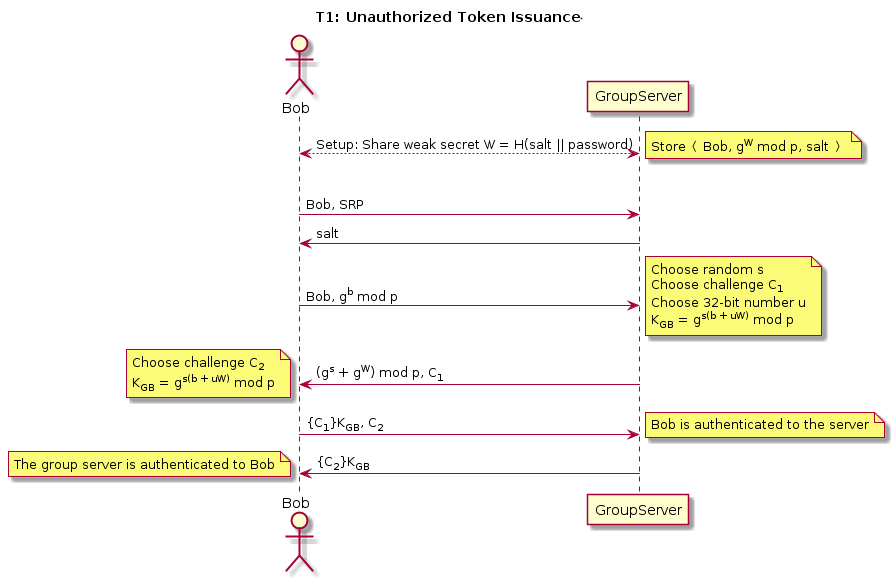

# CS 1653: Applied Cryptography and Network Security -- Phase 3 #
## Overview ##

This phase of the project is the first stage of hardening our Galactic File-Hosting Service (GFHS). We are still operating under the general assumption that the group server is entirely trustworthy, and that once a user has identified a file server appropriately, that server is also trustworthy and obeys all its rules. However, we will add some measures to enhance security on tokens, the user and file server ends, and to protect against third party monitoring on all communications.

We will use a variety of techniques and protocols to address the given threat models and keep our system secure. Some of these include the Secure Remote Password (SRP) protocol and Diffie-Hellman (D-H) key exchange. To implement these protocols we will use various tools including RSA-2048, SHA-256, and AES.

## Threat Models ##
### T1: Unauthorized Token Issuance ###
This threat has to do with illegitimate or malicious parties requesting (and receiving) another user's token, thereby gaining access to that user's files and groups. This is problematic if that information is intended to be secure in any fashion (i.e. confidential or protected from unauthorized modification). Currently our system only requires a username in order to access that user's account--with all associated privileges--requiring no further form of authentication. An adversary can thus access any account she knows the name of, which is obviously undesirable.  

To address this threat, we chose to implement a Secure Remote Password (SRP) protocol, relying on a shared secret (i.e. password) between the user and the groupserver. This secret is set at user creation, and the groupserver stores <User, Value> pairs, where the Value is a SHA-256 hash (+ salt!) of the user's password. We chose SHA-256 because it is recommended for a variety of applications by NIST, along with salt to inhibit brute-force attacks. We chose SRP because it provides mutual authentication of the user and groupserver and simultaneously allows them to agree on a session key, all securely and over an open channel. At this point that key can be used for the remainder of the session. This protocol is represented diagrammatically below:  

  
