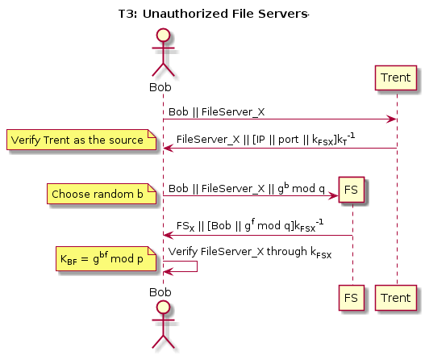

# CS 1653: Applied Cryptography and Network Security -- Phase 3 #
## Overview ##

This phase of the project is the first stage of hardening our Galactic File-Hosting Service (GFHS). We are still operating under the general assumption that the group server is entirely trustworthy, and that once a user has identified a file server appropriately, that server is also trustworthy and obeys all its rules. However, we will add some measures to enhance security on tokens, the user and file server ends, and to protect against third party monitoring on all communications.

We will use a variety of techniques and protocols to address the given threat models and keep our system secure. Some of these include the Secure Remote Password (SRP) protocol and Diffie-Hellman (D-H) key exchange. To implement these protocols we will use various tools including RSA-2048, SHA-256, and AES.

## Threat Models ##
### T1: Unauthorized Token Issuance ###
This threat has to do with illegitimate or malicious parties requesting (and receiving) another user's token, thereby gaining access to that user's files and groups. This is problematic if that information is intended to be secure in any fashion (i.e. confidential or protected from unauthorized modification). Currently our system only requires a username in order to access that user's account--with all associated privileges--requiring no further form of authentication. An adversary can thus access any account she knows the name of, which is obviously undesirable.  

To address this threat, we chose to implement a Secure Remote Password (SRP) protocol, relying on a shared secret (i.e. password) between the user and the groupserver. This secret is set at user creation, and the groupserver stores <User, Value> pairs, where the Value is a SHA-256 hash (+ salt!) of the user's password. We chose SHA-256 because it is recommended for a variety of applications by NIST, along with salt to inhibit brute-force attacks. We chose SRP because it provides mutual authentication of the user and groupserver and simultaneously allows them to agree on a session key, all securely and over an open channel. At this point that key can be used for the remainder of the session. This protocol is represented diagrammatically below:  

  

We can see that this process ensures that at the end of the exchange:
-   Bob and the groupserver have authenticated each other.
-   Bob and the groupserver have correctly agreed on the same session key.
-   This session key is known only to Bob and the groupserver.

These are true because the SRP exchange relies on prior knowledge of the secret W, which is never transmitted (and thus not able to be intercepted), and which is used in the (large and unfactorable) calculation of the session key KGB. This means that the only parties who will be able to correctly calculate KGB are Bob and the groupserver. Thus, at the point of Bob's response to challenge C1, he is authenticated to the groupserver, and vice versa with C2 authenticating the groupserver to Bob.

### T2: Token Modification/Forgery ###
This threat has to do with users--who may or may not have malicious intent--desiring to further their access privileges or impersonate another user. They theoretically could do so through modification of a token, which specifies the user's access to groups. If users could edit a token, they could give themselves access to every group in the system--enabling him/her to manage files in the group. Essentially, that user could get into a group and add or delete files without permission (someone adding them to the group). Currently, our system works such that a user obtains a token from the groupserver that authorizes him/her to only operate on groups they want to (selecting from the ones they have access to) for that session, following the principle of least privilege. Once a user has that groupserver token, there aren't any measures in place to stop them from editing its contents.

To address this threat, we chose to use RSA signatures to guarantee the validity of a token. The groupserver is the only place that makes/grants tokens, so each token that is issued by it will be signed using the groupserver's private key. With that in place, any attempted modifications to a groupserver-signed token will void it, rendering it useless. Additionally, a user cannot forge a new token with the groupserver's signature, because only the groupserver knows its own private key. Only tokens signed by the groupserver will be accepted in the system, and any party can verify token validity with the groupserver's public key--which is publicly available.

  

This diagram shows the process undergone any time Bob needs to acquire a new token. The groupserver will only issue a (signed) token to the person requesting it if they have the appropriate a priori key K. Here, Bob uses his password (set up at the time of account creation) to authenticate himself to the groupserver. Then the groupserver can send back a likewise encrypted token that it has signed, giving Bob access to all the groups he requested. If Bob or anyone else modifies his token, then it will be verified as rubbish by any fileserver/other parties seeking to authenticate Bob.

### T3: Unauthorized File Servers ###
This threat involves the possibility of a malicious fileserver or man in the middle (MiTM) posing as a fileserver. If such a situation occurs, a user (say Bob) is at risk of 

### T4: Information Leakage via Passive Monitoring ###
