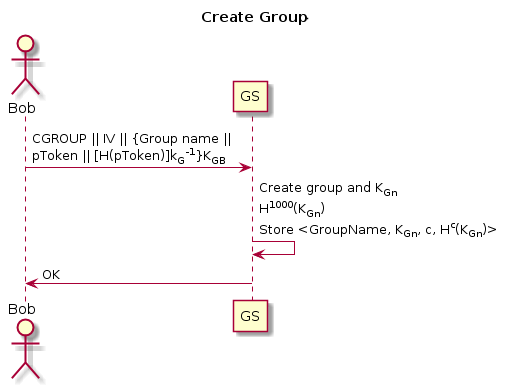

# CS 1653: Applied Cryptography and Network Security -- Phase 4 #
## Overview ##

This phase of the project is the second stage of hardening our Galactic File-Hosting Service (GFHS). We are still operating under the general assumption that the group server is entirely trustworthy--however, the group server is not assumed to share secrets with the file servers in the system. We accounted for this in our previous phase, having assumed no previous sharing between servers and establishing secure lines of communication before proceeding.  

We use a variety of techniques and protocols to address the given threat models and keep our system secure. These are specified herewith, along with reasoning and justification for each. We also implemented a trusted public key infrastructure, called Trent. This server provides public keys for registered servers. Trent's public key serves as a trust anchor.

*   Protocols:
    -   Key Update (KU) -- Our key update mechanism was inspired by the Leslie Lamport OTP scheme. The goal of this protocol is for a group to have access to N unique AES keys. We accomplish this by having the group server generate a unique AES key for each group, then that key is hashed using SHA-256 N times. The security of hashing the key can be trusted because it relies on the preimage resistance of SHA-256, which has not known to be compromised. When a key change needs to occur the group key is updated with the hash N-1. This is explained in full in T6.

*   Tools and Algorithms:
	  -   AES (128-bit) -- We chose AES because it is the *de facto* standard for quick and secure symmetric key encryption according to NIST. The 128-bit version is projected to be secure for a number of years, and provides for the time being essentially the same security as larger key sizes.[1](#f1)  We use AES with Galois/Counter Mode (GCM), which conveniently allows to both encrypt *and* authenticate in the same go. This allows us to detect errors or tampering with the ciphertext in some more secure way than just getting garbage when we decrypt. We can also add data to the AAD field to protect from additional active attackers. We chose to forgo any message padding for the time being to eliminate confusion and keep things simple.  
	  -   SHA-256 -- We chose SHA-256 because it is recommended for a variety of applications by NIST [3](#f3). This is used for: validating user passwords on the GroupServer, hashing user Tokens in order to verify their origin, and for establishing group symmetric keys for encrypting files. When using it to hash passwords we include a salt to inhibit brute-force attacks. Details are in sections T1 and T2, respectively.  
	  -   RSA-2048 -- We use RSA signatures to guarantee the validity of a token and to sign public keys issued by Trent. RSA-2048 is approved by NIST for generation/verification of digital signatures and keys,[2](#f2) which is exactly what we are using it for.  

*   Bonus:
    - @jondyer made a super duper awesome script that autolaunches all of the necessary servers and client application on your local machine and added flags for different system functionalities.

## Threat Models ##
### T5: Message Reorder, Replay, Modification ###
This threat has to do with the constant potential threat of a man in the middle (MiTM) attack, which could come in the form of message reorder, replay, or modification. A MiTM attack could potentially allow the attacker to assume the identity of the user or the server, and could use this position to access information or cause either party to leak information.

We took steps in the previous phase of the project to defend against these threats. Firstly, we authenticate each requested server to the user by signing essential messages in the D-H exchange using the server's private key. Only the server has access to that key, so if a malicious party poses as that server then its messages won't be verified. Even if an attacker intercepts and resends an old response from the server, they won't have access to either party's private D-H number, and thus will not be able to figure out the symmetric key. See the following image for details of that protocol:

Generating Symmetric Key  
  

To ensure that none of these attacks would work on our system, we (1) encrypted all communications (not including public keys) with 128-bit AES keys, operating in Galois-Counter-Mode (GCM), and (2) provided message sequence numbers on every communication.  

1) GCM includes built-in authentication tags that are tamper evident. Should any part of the message be modified, the ciphertext will no longer match the tag, and in this way we know that the message has been modified. An error will be thrown on message decryption that indicates that the ciphertext has been modified (or that an error has corrupted it), making modification no longer a viable attack vector. This includes modifications that simply rearrange the ciphertext that is already present.

2) We also expanded the message fields to include a sequence number that is reset every session, to defend from replay and reorder attacks. The sequence number can be used to distinguish the order of each message (Message 1 in the process labeled with a "1", Message 2 with a "2", etc.) so that any message sent by a MiTM not in the correct sequence will immediately be recognized as fraudulent and the session will terminate. Both parties (client and server) keep track of the sequence for their session together, so regardless of who receives the replayed or reordered message, that party knows it is invalid.

Note also that because we use a D-H exchange to generate each session key uniquely, it is impossible to replay an entire session since the new key will be different and the to-be-tricked party will not recognize it.  

See below for updated diagrams:

  

### T6: File Leakage ###
This threat has to do with a file server unintentionally (or intentionally) leaking files to a third party, who may be unauthorized to view the file contents. This is obviously quite problematic and not desirable, because we don't want unauthorized person(s) being able to see file contents of a group they do not belong to.

When a user joins a group, they should be able to access existing group files which were created before the user joined. We assumed that the user to be added should have this access or else a new group would be created. When a user is removed from the group they should not be able to see any changes from the point that they were removed. We are under the assumption that the user could have downloaded and decrypted all files they had access to right before they were removed. So this means it isn't harmful if they are able to decrypt leaked files that haven't changed, however they should not be able to decrypt new or altered files.  

To address this threat, we encrypt every file on the file server using symmetric 128-bit AES keys. Keys will exist on a group-basis, meaning every group has a single key to decrypt its files. This key will be shared among members of the group only, so that only an authorized member of the group can access a file. The file server will not store said key or know about each group's key, since they are largely untrusted. If a file server were to store these keys, all files could be compromised if the file server leaked these keys. Should a member be removed from the group, the symmetric key will be rotated to a fresh one and be available to all current members. This is to ensure that a new member may access files once he/she joins and that no previous member can still access group files.  

Managing and distributing these group keys is a task that can easily be carried out by the GroupServer, which is a trusted entity. Since they are strictly group-dependent and *not* fileserver-dependent, the GroupServer is sure to have all necessary information to deal with them:  
-   The GroupServer authenticates all users who connect to it as part of the SRP handshake that happens at the beginning of a user's session, so there is no risk of the GroupServer sending a group-key to someone not in the group.  
-   Even if an attacker intercepts the message from the GroupServer where this key is being issued, it will be encrypted (just like everything else) using the 128-bit AES session key that was established during the SRP protocol, so there is no chance the attacker will be able to figure out the group-key.  
-   When groups change, that change is recorded and dealt with by the GroupServer already, so it will be straightforward to have the GroupServer update the group-key while only issuing it to current or new members.  

We chose to base our key update mechanism off of the Leslie Lamport OTP scheme. This will allow us to easily update keys without having to batch re-encrypt all files. When a group is created, the group server will generate a 128-bit AES key and hash that key 1000 times. The server will store the original key, the current hash number, and the current key. When a user is removed from a group, the group server will decrement the hash number and update the current key. All new or updated material will be encrypted with this new key. If a user wishes to decrypt a file they simply take the difference between the hash number, which is stored in the ShareFile, and the current hash number of the key, which is provided by the group server. They then hash the current key that number of times. This ensures forward secrecy while allowing for backward compatibility.  

  

### T7: Token Theft ###
This threat deals with file servers stealing tokens and attempting to pass them on to another user. This other user may be able to use this token to gain access to a group and its files on another file server. In a given user session, the user can only connect to a single file server, where upon startup the server's address is specified (or defaults to localhost if none is entered). In order to connect to a different file server, the user would have to start a new session and specify the new server he/she wishes to connect to--it is not possible to change this during a session.

Using this setup, our solution to this threat was to make a token valid only for the current file server. Binding the token itself to the selected file server will make it non-transferable to another session or server. We will do this by adding a field to the token itself--the address (IP address:port) of the file server being used. The GroupServer will add the specified file server address from the user and the current time to the token itself. In short, the GroupServer process remains the same for creation of a token, there is just another field being added. This will not affect the uniqueness of the token identifier- where the order of groups does not affect the hash output of the identifier, because the groups will still be sorted by name. This IP address and time will simply be appended onto the unique token identifier, separated by the colon (:) delimiter in the same fashion as in T2, leaving functionality unaffected.
This way, when connecting to the file server:
-   We can match the address on the token to the file server's address (IP Address and Port #) to ensure that it is not being used on a different server.
-   We can make sure the Token has still been signed by the GroupServer.

## Summary ##
Overall, we evaluated each threat on its own and determined how best to protect against it. Then we examined our existing protective measures and integrated our new solutions with them to ensure that we covered each new threat without compromising the integrity of previous threat-protective measures. With this in mind we have now to consider the previous four threats from phase 3.  

With the addition of new threat models it is important to ensure that we the previous threats are still being protected against. No changes to our login protocol were necessary so T1 is not broken. With the introduction of T7, our token must change. This process does not interfere with measures put forth to counter threat model T2. Users still cannot modify tokens to enhance their privileges, we are simply expanding information stored in the token. The tokens are still being signed by the GroupServer after its creation, so any modifications to a token will invalidate it. The GroupServer's public key will still available to any third party so that they can verify any token for its validity. Now we are under the assumption that file servers are mostly untrusted and may leak files. However this does not change our registration process so T3 is still valid. This phase of the project assumes that a passive listener or active attacker can be involved in any messages. This means we must be careful to make sure that all necessary communication is encrypted. We also need to be sure to verify the integrity of things like tokens through private key signing.

<b id="f1">1:</b> <http://nvlpubs.nist.gov/nistpubs/SpecialPublications/NIST.SP.800-175B.pdf> [↩](#a1)  
<b id="f2">2:</b> <https://csrc.nist.gov/csrc/media/publications/fips/140/2/final/documents/fips1402annexa.pdf> [↩](#a2)  
<b id="f3">3:</b> <http://nvlpubs.nist.gov/nistpubs/FIPS/NIST.FIPS.186-4.pdf> [↩](#a3)
