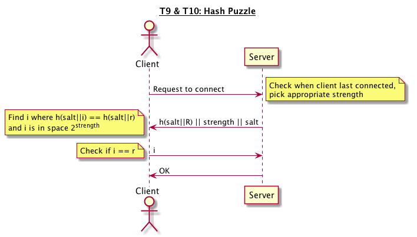

# CS 1653: Applied Cryptography and Network Security -- Phase 5 #
## Overview ##
The final phase of the project involves self-directed hardening against self-directed threats to our Galactic File-Hosting Service (GFHS). We will operate under the same trust model as in phase 4 (described below), but will protect against other threats present within the framework of that trust model. Specifically, our trust model supposes the following from phase 4:  

-   **Group Server**: The group server is entirely trustworthy. In this phase of the project, this means that the group server will only issue tokens to properly authenticated clients and will properly enforce the constraints on group creation, deletion, and management specified in previous phases of the project. The group server is not assumed to share secrets with the file servers in the system.  

-   **File Servers**: In this phase of the project, file servers will be assumed to be largely untrusted. In particular, file servers might leak files to unauthorized users or attempt to steal user tokens.  

-   **Clients**: We will assume that clients are not trustworthy. Specifically, clients may attempt to obtain tokens that belong to other users and/or modify the tokens issued to them by the group server to acquire additional permissions. Additionally, clients may attempt to log in as another user or discover another user's password.  

-   **Other Principals**: We assume that *all* communications in the system might be intercepted by an *active attacker* that can insert, reorder, replay, or modify messages. Outside attackers may also seek to establish a connection with any server they wish.  

*   Protocols:  
    -   Hash inversion puzzle -- for T9 and T10, we rely on the difficulty of finding the input that results in a given output hash (combined with a given "salt"). This requires brute-forcing the domain-space of the puzzle; so, if the puzzle has strength 'str' then on average a solution will take 2str operations to find. 

*   Tools and Algorithms:  
    -   SHA-256 -- For our hash puzzle (described above) we use the SHA-256 hash function, since it is already used elsewhere in this system and is thus most convenient. Additionally, it has all three properties desired of a cryptographically secure hash function (unlike MD5) which makes it ideal for this kind of puzzle.
    -   De la Briandais trie -- We use this structure to store strings at least 8 characters long that fall within the 1 million most common passwords. This structure is flexible and space-efficient, while still being very fast (constructed in less than 1s and with negligible lookup times).

## Threat Models ##
### T8: Weak Passwords ###
The lack of restriction for password creation makes it easy for users to be created with basic or simple passwords, giving a low level of protection should an attacker discover a username and attempt to guess the corresponding password. Our system was previously enforcing no rules for password creation, not even for the administrator account. Thus, common and short passwords such as `password` or `1234` are allowed, leaving those accounts vulnerable to a brute force attack on their passwords.

Our solution to this threat is to require a minimum length on all passwords, in accordance with the latest NIST guidelines.[1](#f1) We make this minimum length to be no less than 8 characters. While we encourage the user to make lengthy passwords that are harder to brute force and/or guess, we will limit password length at 100 characters maximum, because excessively long passwords can take additional time to hash.  We do not find it necessary to add a complexity requirement, as per NIST guidelines[1](#f1), because research has shown this to be somewhat ineffective, as it has potential to add negative value to the secret. If a user must add an uppercase letter, number, and a symbol; they will likely change `password` to `Password1!` --  making it very predictable to guess the behavior, and therefore adding no more security to the password. We also check the user's password against a dictionary of common passwords of 8 characters or more and reject it if there is a match.  

We believe that implementing these changes makes it much more difficult for an attacker to compromise passwords. They will have a harder time running through a dictionary and will be forced to brute force longer passwords.

### T9: Online Password Attack ###
This threat involves the potential for someone to make a brute-force attack on a user's password by attempting to login repeatedly, perhaps with a dictionary of words, as a given user. This was previously possible since our interface simply exits the client app on a mis-entry and allows the user to start another one and keep trying.

We address this vulnerability by implementing an exponential backoff system for repeated connection attempts. This is implemented by requiring solution of an increasingly difficult hash puzzle before a connection can continue, with a 10-minute cooldown on difficulty reset. Here are the basic steps:  
-   Any time a client makes a connection to a server, that client's machine is required to solve a hash inversion puzzle before anything else.  
-   At first the difficulty is negligible, so there is only a slight delay. However, the server records that such a connection attempt was made (by that IP) and increments the 'difficulty level' of the puzzle for the next attempt.
-   Further attempts to connect within a 10-minute period of the previous connection attempt will continue to increase the puzzle difficulty in an exponential fashion.
-   If an attempt to connect is more than 10 minutes after the last attempt, the difficulty will reset, as mentioned.

This mechanism will prevent attackers from rapidly connecting to the server in order to launch a dictionary-type attack on a user's password,  *especially* combined with the password rule enforcement above.  

Exponential backoff will prevent an attacker from compromising as many accounts as was previously possible. T8 forces the attacker to brute force a stronger password and the exponential backoff will greatly limit the number of attempts possible.  

### T10: Login DOS Attack ###
This threat comes by way of any malicious party who decides to interrupt the availability of the file-hosting service. Specifically, someone can perform a denial-of-service (DOS) attack by attempting to connect and login with garbage user/password pairs from many different clients at once. As per our attack script `attack_T10.sh` it is simple to write a basic script that performs this function, and our server *did* crash/hang when overloaded in this way.  

This problem can be solved on the server side by requiring a puzzle to be solved (as described above), which disallows those connections with an incorrect solution or which have made too many connections within the last 10 minutes. The puzzle needs to be something that takes enough work on the client side to prevent the client from performing a DOS attack, but easy enough on the server to check so that it can still accept many incoming connections.  

These goals are accomplished by the **same mechanism described in T9**. That is, the exponential backoff system as implemented above provides the same protection against a DOS attack as it does for an online password attack. On the client side they will have to perform a large number of hash operations and string comparisons after several repeated attempts to connect. However, the server only needs one string comparison to verify a connection. This leverages the inherent **resource disparity** of the hash inversion puzzle.  

This is effective because it forces the client to do work when submitting a connection so that they will effectively DOS themselves before harming the server.  

  

## Summary ##
In summary, we have three new threats that each pose a problem for our GFHS. The first has to do with the potential for an adversary to guess a user's password. This is inhibited not only by the minimum password requirements we enforce, but also by the mechanism we implemented to protect against T9, which restricts the number of connections any IP address can attempt within a short period of time. This makes it impossible to run an online password attacking script like the one given above as `attack_T9.sh`, which previously might have guessed a common dictionary word if used as a password. This leads to our final threat, which is very similar and involves attempting to establish many connections in a short time in order to overwhelm the server and deny service to other legitimate users. It is clear that these three attacks are related, and their solutions work in harmony, without compromising any previously implemented security features.

### Nice extra credit features: ###
-   Salting our stored password hashes also prevents offline attacks in the event of a leak/hashdump, since attackers are forced to freshly hash their guesses alongside the salt for any given user.

#### References ####
<b id="f1">1:</b> <https://pages.nist.gov/800-63-3/sp800-63b.html#appA> [↩](#a1)
